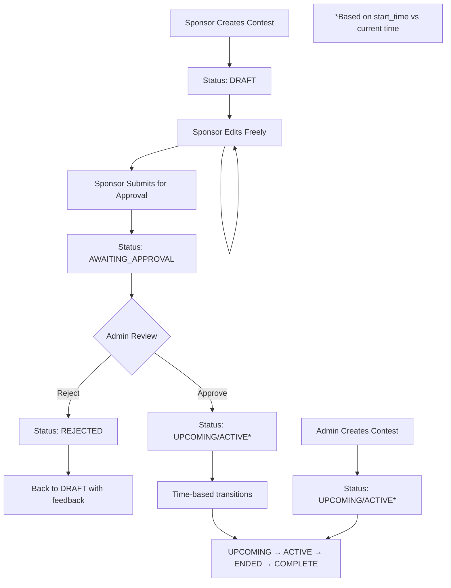

# 🎯 Enhanced Contest Status System

**Status**: ✅ **Fully Implemented & Production Ready** (January 2025)

## 📋 Overview

The Enhanced Contest Status System separates **publication workflow** from **contest lifecycle**, providing a clear, intuitive status management system that supports draft creation, approval workflows, and predictable contest states.

**Key Features:**
- ✅ **8-state workflow** with clear transitions
- ✅ **Sponsor draft workflow** - create, edit, submit for approval
- ✅ **Admin approval queue** - dedicated interface with bulk operations
- ✅ **Complete audit trail** - track all status changes with reasoning
- ✅ **Unified deletion API** - intelligent protection rules
- ✅ **Legacy system cleanup** - all deprecated fields removed

## 🔄 Status Flow Diagram



## 📊 Status Definitions

| Status | Description | Visibility | Can Edit | Can Delete | Entry Allowed |
|--------|-------------|------------|----------|------------|---------------|
| **`draft`** | Sponsor working copy | Creator only | ✅ Full | ✅ Yes | ❌ No |
| **`awaiting_approval`** | Submitted for admin review | Creator + Admins | ❌ No | ✅ Creator only | ❌ No |
| **`rejected`** | Admin rejected, needs revision | Creator only | ✅ Full | ✅ Yes | ❌ No |
| **`upcoming`** | Approved, scheduled for future | All users* | 🔒 Admin override | 🔒 Protection rules | ❌ Not started |
| **`active`** | Currently accepting entries | All users* | 🔒 Admin override | ❌ No | ✅ Yes |
| **`ended`** | Time expired, no winner selected | All users* | 🔒 Admin override | 🔒 Protection rules | ❌ Ended |
| **`complete`** | Winner selected and announced | All users* | ❌ No | ❌ No | ❌ Complete |
| **`cancelled`** | Contest cancelled by admin | All users* | ❌ No | ❌ No | ❌ Cancelled |

*Subject to approval filter for authenticated users

## 🛠️ Technical Implementation

### Database Schema

```sql
-- Enhanced status field (IMPLEMENTED)
ALTER TABLE contests ADD COLUMN status VARCHAR(20) DEFAULT 'draft' NOT NULL;
ALTER TABLE contests ADD CONSTRAINT chk_contest_status 
CHECK (status IN ('draft', 'awaiting_approval', 'rejected', 'upcoming', 'active', 'ended', 'complete', 'cancelled'));

-- Status audit trail
CREATE TABLE contest_status_audit (
    id SERIAL PRIMARY KEY,
    contest_id INTEGER NOT NULL REFERENCES contests(id),
    old_status VARCHAR(20),
    new_status VARCHAR(20) NOT NULL,
    changed_by_user_id INTEGER REFERENCES users(id),
    reason TEXT,
    created_at TIMESTAMP WITH TIME ZONE DEFAULT NOW()
);
```

### Status Calculation Logic

```python
def calculate_contest_status(
    current_status: str,
    start_time: datetime,
    end_time: datetime,
    winner_selected_at: Optional[datetime] = None,
    now: Optional[datetime] = None
) -> str:
    # Publication workflow statuses don't change based on time
    if current_status in ['draft', 'awaiting_approval', 'rejected']:
        return current_status
    
    # Administrative statuses are permanent
    if current_status == 'cancelled':
        return current_status
    
    # For published contests, calculate lifecycle status
    if winner_selected_at:
        return 'complete'
    elif end_time <= now:
        return 'ended'
    elif start_time > now:
        return 'upcoming'
    else:
        return 'active'
```

## 🔌 API Endpoints

### Sponsor Workflow Endpoints

| Method | Endpoint | Description |
|--------|----------|-------------|
| `POST` | `/sponsor/workflow/contests/draft` | Create new draft contest |
| `PUT` | `/sponsor/workflow/contests/{id}/draft` | Update draft contest |
| `GET` | `/sponsor/workflow/contests/drafts` | Get all draft/rejected contests |
| `POST` | `/sponsor/workflow/contests/{id}/submit` | Submit for approval |
| `POST` | `/sponsor/workflow/contests/{id}/withdraw` | Withdraw from approval |
| `GET` | `/sponsor/workflow/contests/pending` | Get contests awaiting approval |
| `DELETE` | `/sponsor/workflow/contests/{id}/draft` | Delete draft contest |

### Admin Approval Endpoints

| Method | Endpoint | Description |
|--------|----------|-------------|
| `GET` | `/admin/approval/queue` | Get approval queue with pagination |
| `POST` | `/admin/approval/contests/{id}/approve` | Approve or reject contest |
| `POST` | `/admin/approval/contests/bulk-approve` | Bulk approve/reject |
| `POST` | `/admin/approval/contests/{id}/status` | Change contest status (override) |
| `GET` | `/admin/approval/statistics` | Get approval workflow statistics |
| `GET` | `/admin/approval/contests/{id}/audit` | Get contest audit trail |
| `POST` | `/admin/approval/update-statuses` | Batch update statuses (cron job) |

### Enhanced Public Endpoints

All existing public endpoints (`/contests/*`) now use the enhanced status system:

- **`/contests/active`** - Only shows contests with `status = "active"`
- **`/contests/nearby`** - Only shows active contests with geolocation
- **`/contests/{id}`** - Shows contest with calculated status
- **`/contests/{id}/enter`** - Validates entry based on enhanced status

## 👥 User Experience Changes

### For Sponsors

**Before:**
- Create contest → Immediately visible (if approved)
- No draft capability
- Limited editing once submitted

**After:**
- Create draft → Iterate freely
- Submit when ready → Clear approval process
- Get feedback on rejections → Revise and resubmit

### For Admins

**Before:**
- Mixed approval states
- No clear approval queue
- Manual status management

**After:**
- Dedicated approval queue
- Clear pending vs. published distinction
- Bulk approval operations
- Comprehensive audit trail

### For Users

**Before:**
- Inconsistent contest visibility
- Confusing status calculations

**After:**
- Only see published, active contests
- Clear, predictable status information
- Better error messages for entry attempts

## 🔒 Permission Matrix

### Contest Creation

| User Type | Default Status | Approval Required |
|-----------|----------------|-------------------|
| **Admin** | `upcoming`/`active` | ❌ No - Auto-approved |
| **Sponsor** | `draft` | ✅ Yes - Must submit |

### Contest Editing

| Status | Admin | Sponsor (Owner) | Others |
|--------|-------|-----------------|--------|
| `draft` | ✅ Yes | ✅ Yes | ❌ No |
| `awaiting_approval` | ✅ Yes | ❌ No | ❌ No |
| `rejected` | ✅ Yes | ✅ Yes | ❌ No |
| `upcoming` | 🔒 Override | ❌ No | ❌ No |
| `active` | 🔒 Override | ❌ No | ❌ No |
| `ended` | 🔒 Override | ❌ No | ❌ No |
| `complete` | ❌ No | ❌ No | ❌ No |

### Contest Deletion

| Status | Admin | Sponsor (Owner) | Conditions |
|--------|-------|-----------------|------------|
| `draft` | ✅ Yes | ✅ Yes | No entries |
| `awaiting_approval` | ✅ Yes | ✅ Yes | No entries |
| `rejected` | ✅ Yes | ✅ Yes | No entries |
| `upcoming` | 🔒 Protection rules | 🔒 Protection rules | No entries |
| `active` | ❌ No | ❌ No | Has entries |
| `ended` | 🔒 Protection rules | 🔒 Protection rules | No entries |
| `complete` | ❌ No | ❌ No | Has winner |

## 📈 Status Transitions

### Automatic Transitions (Time-based)

```python
# Batch job runs periodically
def update_contest_statuses():
    for contest in published_contests:
        new_status = calculate_contest_status(
            contest.status, contest.start_time, 
            contest.end_time, contest.winner_selected_at
        )
        if new_status != contest.status:
            transition_status(contest, new_status, reason="Automatic time-based update")
```

### Manual Transitions

| From | To | Who | Trigger |
|------|----|----|---------|
| `draft` | `awaiting_approval` | Sponsor | Submit for approval |
| `awaiting_approval` | `upcoming`/`active` | Admin | Approve contest |
| `awaiting_approval` | `rejected` | Admin | Reject contest |
| `awaiting_approval` | `draft` | Sponsor | Withdraw submission |
| `rejected` | `awaiting_approval` | Sponsor | Resubmit after fixes |
| `ended` | `complete` | Admin | Select winner |
| Any | `cancelled` | Admin | Cancel contest |

## 🔍 Visibility Rules

### Public Users (No Auth)
- ✅ See: `upcoming`, `active`, `ended`, `complete`
- ❌ Hidden: `draft`, `awaiting_approval`, `rejected`, `cancelled`

### Authenticated Users
- ✅ See: `upcoming`, `active`, `ended`, `complete` (published contests)
- ❌ Hidden: `draft`, `awaiting_approval`, `rejected`, `cancelled`
- 🔒 **Status Filter**: Only published contests visible to general users

### Sponsors
- ✅ See: Own contests in any status
- ❌ Hidden: Other sponsors' draft/pending contests

### Admins
- ✅ See: All contests in any status
- ✅ Manage: Full approval workflow

## ✅ Implementation Status

### Database Schema
- ✅ **Enhanced status field** with 8-state enum
- ✅ **Status audit table** for change tracking
- ✅ **Workflow metadata fields** (submitted_at, approved_at, etc.)
- ✅ **Legacy field cleanup** completed

### API Implementation
- ✅ **Enhanced status calculation** logic
- ✅ **Unified contest filtering** across all endpoints
- ✅ **Sponsor workflow endpoints** for draft management
- ✅ **Admin approval endpoints** for review process
- ✅ **Status transition validation** and audit

### Frontend Integration
- ✅ **Status display components** for all 8 states
- ✅ **Draft workflow UI** for sponsors
- ✅ **Admin approval queue** interface
- ✅ **Enhanced contest filtering** logic

## 📊 Monitoring & Analytics

### Key Metrics
- **Approval Queue Length**: Number of contests awaiting approval
- **Average Approval Time**: Time from submission to approval/rejection
- **Rejection Rate**: Percentage of contests rejected
- **Status Distribution**: Count of contests by status
- **Workflow Efficiency**: Time spent in each status

### Audit Trail
Every status change is logged with:
- Old and new status
- User who made the change
- Timestamp
- Reason for change
- Contest context

## 🔧 Configuration

### Environment Variables
```bash
# Status update job frequency (minutes)
CONTEST_STATUS_UPDATE_INTERVAL=15

# Approval queue page size
APPROVAL_QUEUE_DEFAULT_SIZE=20

# Auto-approve admin contests
ADMIN_AUTO_APPROVE=true
```

### Feature Flags
```python
# Enable enhanced status system
ENHANCED_STATUS_ENABLED = True

# Enable draft workflow for sponsors
SPONSOR_DRAFT_WORKFLOW = True

# Enable bulk approval operations
BULK_APPROVAL_ENABLED = True
```

## 🎯 Benefits

### 1. **Clear Separation of Concerns**
- Publication workflow vs. contest lifecycle
- Distinct rules and behaviors for each phase

### 2. **Improved User Experience**
- **Sponsors**: Draft → iterate → submit workflow
- **Admins**: Dedicated approval queue and tools
- **Users**: Only see relevant, active contests

### 3. **Better System Reliability**
- Predictable status transitions
- Comprehensive audit trail
- Automated status updates

### 4. **Enhanced Visibility**
- Clear approval workflow
- Status-based permissions
- Detailed analytics and reporting

## 🔮 Future Enhancements

### Planned Features
- **Contest Templates**: Save draft as template
- **Scheduled Publishing**: Auto-approve at specific time
- **Approval Workflows**: Multi-step approval process
- **Status Notifications**: Email/SMS on status changes
- **Advanced Analytics**: Conversion funnel analysis

### Possible Status Extensions
- **`paused`**: Temporarily stopped, can resume
- **`archived`**: Historical contests, read-only
- **`scheduled`**: Future contests with auto-activation

---

**✅ The Enhanced Contest Status System provides a robust, intuitive foundation for contest lifecycle management that scales with business needs while maintaining clarity for all user types.**
