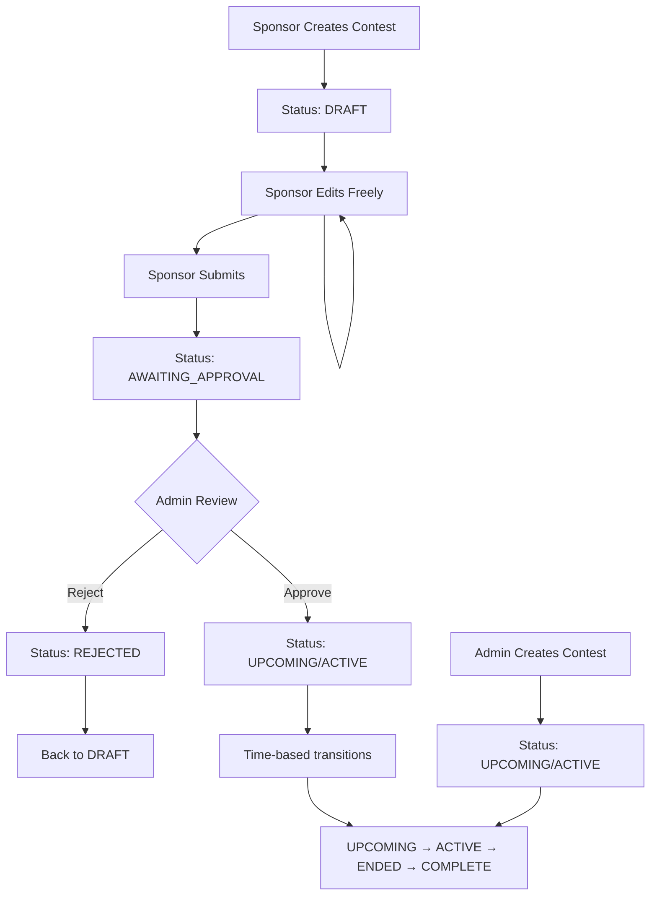

# 🚀 Enhanced Contest Status System - Frontend Upgrade Guide

**Complete frontend integration guide for upgrading to the Enhanced Contest Status System with 8-state workflow.**

**Status**: ✅ **Backend Fully Implemented** - Ready for Frontend Integration (January 2025)

---

## 🎯 **Upgrade Overview**

The Enhanced Contest Status System introduces a sophisticated workflow that separates **publication** from **contest lifecycle**, providing better user experience for sponsors and clearer admin oversight.

### **🔄 Key Changes**
- **8 Status States** instead of 4 simple states
- **Sponsor Draft Workflow** for iterative contest creation
- **Admin Approval Queue** with bulk operations
- **New API Endpoints** for workflow management
- **Enhanced Permissions** based on status and user role

---

## 📋 **Migration Checklist**

### **✅ Backend Implementation Status**

#### **✅ Backend Complete - Ready for Frontend**
- ✅ **8-state status system** fully implemented
- ✅ **Sponsor workflow endpoints** (`/sponsor/workflow/`) operational
- ✅ **Admin approval endpoints** (`/admin/approval/`) operational
- ✅ **Unified deletion API** with intelligent protection
- ✅ **Status audit trail** with complete history
- ✅ **Database schema** updated with all required fields
- ✅ **Service layer** with status transition logic
- ✅ **All API endpoints** tested and documented

### **📋 Required Frontend Updates**

#### **1. Status Display Updates**
- [ ] Update status badges/indicators for 8 new states
- [ ] Add draft and approval workflow UI components
- [ ] Update contest cards to show appropriate status information
- [ ] Add status-specific action buttons

#### **2. Sponsor Workflow Integration**
- [ ] Create draft contest creation flow
- [ ] Add draft editing interface
- [ ] Implement submission for approval workflow
- [ ] Add draft management dashboard

#### **3. Admin Approval Interface**
- [ ] Create approval queue dashboard
- [ ] Add individual approve/reject functionality
- [ ] Implement bulk approval operations
- [ ] Add approval statistics display

#### **4. API Integration Updates**
- [ ] Update existing contest API calls
- [ ] Integrate new sponsor workflow endpoints
- [ ] Add admin approval endpoints
- [ ] Update error handling for new status system

---

## 🎯 **Status System Changes**

### **📊 Old vs New Status Mapping**

| Old Status | New Status Options | Notes |
|------------|-------------------|-------|
| `upcoming` | `draft`, `awaiting_approval`, `upcoming` | Now separated by workflow stage |
| `active` | `active` | Unchanged for active contests |
| `ended` | `ended` | Unchanged for ended contests |
| `complete` | `complete` | Unchanged for completed contests |
| N/A | `rejected`, `cancelled` | New states for workflow management |

### **🔄 Status Flow Diagram**



---

## 🎨 **UI/UX Updates**

### **📱 Status Badges**

#### **Status Badge Component**
```jsx
const StatusBadge = ({ status, className = "" }) => {
  const statusConfig = {
    draft: {
      color: "bg-gray-100 text-gray-800",
      icon: "📝",
      label: "Draft"
    },
    awaiting_approval: {
      color: "bg-yellow-100 text-yellow-800",
      icon: "⏳",
      label: "Awaiting Approval"
    },
    rejected: {
      color: "bg-red-100 text-red-800",
      icon: "❌",
      label: "Rejected"
    },
    upcoming: {
      color: "bg-blue-100 text-blue-800",
      icon: "📅",
      label: "Upcoming"
    },
    active: {
      color: "bg-green-100 text-green-800",
      icon: "🎯",
      label: "Active"
    },
    ended: {
      color: "bg-orange-100 text-orange-800",
      icon: "⏰",
      label: "Ended"
    },
    complete: {
      color: "bg-purple-100 text-purple-800",
      icon: "🏆",
      label: "Complete"
    },
    cancelled: {
      color: "bg-red-100 text-red-800",
      icon: "🚫",
      label: "Cancelled"
    }
  };

  const config = statusConfig[status] || statusConfig.draft;

  return (
    <span className={`inline-flex items-center px-2.5 py-0.5 rounded-full text-xs font-medium ${config.color} ${className}`}>
      <span className="mr-1">{config.icon}</span>
      {config.label}
    </span>
  );
};
```

#### **Status-Specific Action Buttons**
```jsx
const ContestActionButtons = ({ contest, userRole, onAction }) => {
  const { status, id } = contest;
  const isCreator = contest.created_by_user_id === currentUserId;

  // Draft status actions
  if (status === 'draft' && (userRole === 'sponsor' && isCreator || userRole === 'admin')) {
    return (
      <div className="flex space-x-2">
        <button 
          onClick={() => onAction('edit', id)}
          className="btn btn-primary"
        >
          Edit Draft
        </button>
        <button 
          onClick={() => onAction('submit', id)}
          className="btn btn-success"
        >
          Submit for Approval
        </button>
        <button 
          onClick={() => onAction('delete', id)}
          className="btn btn-danger"
        >
          Delete Draft
        </button>
      </div>
    );
  }

  // Awaiting approval actions
  if (status === 'awaiting_approval') {
    if (userRole === 'admin') {
      return (
        <div className="flex space-x-2">
          <button 
            onClick={() => onAction('approve', id)}
            className="btn btn-success"
          >
            Approve
          </button>
          <button 
            onClick={() => onAction('reject', id)}
            className="btn btn-danger"
          >
            Reject
          </button>
        </div>
      );
    } else if (userRole === 'sponsor' && isCreator) {
      return (
        <button 
          onClick={() => onAction('withdraw', id)}
          className="btn btn-secondary"
        >
          Withdraw Submission
        </button>
      );
    }
  }

  // Rejected status actions
  if (status === 'rejected' && (userRole === 'sponsor' && isCreator || userRole === 'admin')) {
    return (
      <div className="flex space-x-2">
        <button 
          onClick={() => onAction('edit', id)}
          className="btn btn-primary"
        >
          Edit & Resubmit
        </button>
        <button 
          onClick={() => onAction('delete', id)}
          className="btn btn-danger"
        >
          Delete
        </button>
      </div>
    );
  }

  // Published contest actions (upcoming, active, ended, complete)
  if (['upcoming', 'active', 'ended', 'complete'].includes(status)) {
    if (userRole === 'admin') {
      return (
        <div className="flex space-x-2">
          {status === 'active' && (
            <button 
              onClick={() => onAction('selectWinner', id)}
              className="btn btn-success"
            >
              Select Winner
            </button>
          )}
          <button 
            onClick={() => onAction('edit', id)}
            className="btn btn-secondary"
          >
            Admin Edit
          </button>
        </div>
      );
    }
  }

  return null;
};
```

### **📊 Sponsor Dashboard Updates**

#### **Draft Management Section**
```jsx
const SponsorDashboard = () => {
  const [drafts, setDrafts] = useState([]);
  const [pendingApproval, setPendingApproval] = useState([]);
  const [publishedContests, setPublishedContests] = useState([]);

  useEffect(() => {
    loadSponsorContests();
  }, []);

  const loadSponsorContests = async () => {
    try {
      // Load drafts
      const draftsResponse = await api.get('/sponsor/workflow/contests/drafts');
      setDrafts(draftsResponse.data.contests);

      // Load pending approval
      const pendingResponse = await api.get('/sponsor/workflow/contests/pending');
      setPendingApproval(pendingResponse.data.contests);

      // Load published contests
      const publishedResponse = await api.get('/sponsor/contests');
      setPublishedContests(publishedResponse.data.contests.filter(
        c => ['upcoming', 'active', 'ended', 'complete'].includes(c.status)
      ));
    } catch (error) {
      console.error('Failed to load contests:', error);
    }
  };

  return (
    <div className="space-y-6">
      {/* Draft Contests Section */}
      <section>
        <div className="flex justify-between items-center mb-4">
          <h2 className="text-xl font-semibold">Draft Contests</h2>
          <button 
            onClick={() => createDraftContest()}
            className="btn btn-primary"
          >
            Create New Draft
          </button>
        </div>
        <div className="grid gap-4">
          {drafts.map(contest => (
            <ContestCard 
              key={contest.id} 
              contest={contest} 
              userRole="sponsor"
              onAction={handleContestAction}
            />
          ))}
        </div>
      </section>

      {/* Pending Approval Section */}
      <section>
        <h2 className="text-xl font-semibold mb-4">Pending Approval</h2>
        <div className="grid gap-4">
          {pendingApproval.map(contest => (
            <ContestCard 
              key={contest.id} 
              contest={contest} 
              userRole="sponsor"
              onAction={handleContestAction}
            />
          ))}
        </div>
      </section>

      {/* Published Contests Section */}
      <section>
        <h2 className="text-xl font-semibold mb-4">Published Contests</h2>
        <div className="grid gap-4">
          {publishedContests.map(contest => (
            <ContestCard 
              key={contest.id} 
              contest={contest} 
              userRole="sponsor"
              onAction={handleContestAction}
            />
          ))}
        </div>
      </section>
    </div>
  );
};
```

### **👑 Admin Approval Queue**

#### **Approval Queue Dashboard**
```jsx
const AdminApprovalQueue = () => {
  const [pendingContests, setPendingContests] = useState([]);
  const [selectedContests, setSelectedContests] = useState([]);
  const [statistics, setStatistics] = useState({});
  const [loading, setLoading] = useState(false);

  useEffect(() => {
    loadApprovalQueue();
    loadStatistics();
  }, []);

  const loadApprovalQueue = async () => {
    try {
      const response = await api.get('/admin/approval/queue');
      setPendingContests(response.data.pending_contests);
    } catch (error) {
      console.error('Failed to load approval queue:', error);
    }
  };

  const loadStatistics = async () => {
    try {
      const response = await api.get('/admin/approval/statistics');
      setStatistics(response.data);
    } catch (error) {
      console.error('Failed to load statistics:', error);
    }
  };

  const handleBulkApproval = async (approved) => {
    if (selectedContests.length === 0) return;

    setLoading(true);
    try {
      const response = await api.post('/admin/approval/contests/bulk-approve', {
        contest_ids: selectedContests,
        approved: approved,
        reason: approved ? 'Bulk approval' : 'Bulk rejection'
      });

      // Show results
      toast.success(`${response.data.success_count} contests ${approved ? 'approved' : 'rejected'}`);
      
      // Reload queue
      await loadApprovalQueue();
      setSelectedContests([]);
    } catch (error) {
      toast.error('Bulk operation failed');
    } finally {
      setLoading(false);
    }
  };

  return (
    <div className="space-y-6">
      {/* Statistics Section */}
      <div className="grid grid-cols-1 md:grid-cols-4 gap-4">
        <div className="bg-white p-4 rounded-lg shadow">
          <h3 className="text-sm font-medium text-gray-500">Pending Approval</h3>
          <p className="text-2xl font-bold text-yellow-600">{statistics.pending_approval_count || 0}</p>
        </div>
        <div className="bg-white p-4 rounded-lg shadow">
          <h3 className="text-sm font-medium text-gray-500">Avg Approval Time</h3>
          <p className="text-2xl font-bold text-blue-600">{statistics.avg_approval_time_hours || 0}h</p>
        </div>
        <div className="bg-white p-4 rounded-lg shadow">
          <h3 className="text-sm font-medium text-gray-500">Rejection Rate</h3>
          <p className="text-2xl font-bold text-red-600">{statistics.rejection_rate_percent || 0}%</p>
        </div>
        <div className="bg-white p-4 rounded-lg shadow">
          <h3 className="text-sm font-medium text-gray-500">Total Contests</h3>
          <p className="text-2xl font-bold text-gray-600">{statistics.total_contests || 0}</p>
        </div>
      </div>

      {/* Bulk Actions */}
      {selectedContests.length > 0 && (
        <div className="bg-blue-50 p-4 rounded-lg">
          <div className="flex justify-between items-center">
            <span className="text-sm font-medium">
              {selectedContests.length} contest(s) selected
            </span>
            <div className="space-x-2">
              <button 
                onClick={() => handleBulkApproval(true)}
                disabled={loading}
                className="btn btn-success btn-sm"
              >
                Bulk Approve
              </button>
              <button 
                onClick={() => handleBulkApproval(false)}
                disabled={loading}
                className="btn btn-danger btn-sm"
              >
                Bulk Reject
              </button>
              <button 
                onClick={() => setSelectedContests([])}
                className="btn btn-secondary btn-sm"
              >
                Clear Selection
              </button>
            </div>
          </div>
        </div>
      )}

      {/* Approval Queue */}
      <div className="bg-white rounded-lg shadow">
        <div className="px-6 py-4 border-b">
          <h2 className="text-lg font-semibold">Approval Queue</h2>
        </div>
        <div className="divide-y">
          {pendingContests.map(contest => (
            <ApprovalQueueItem
              key={contest.contest_id}
              contest={contest}
              selected={selectedContests.includes(contest.contest_id)}
              onSelect={(selected) => {
                if (selected) {
                  setSelectedContests([...selectedContests, contest.contest_id]);
                } else {
                  setSelectedContests(selectedContests.filter(id => id !== contest.contest_id));
                }
              }}
              onApprove={() => handleIndividualApproval(contest.contest_id, true)}
              onReject={() => handleIndividualApproval(contest.contest_id, false)}
            />
          ))}
        </div>
      </div>
    </div>
  );
};
```

---

## 🔌 **API Integration Updates**

### **📡 New API Client Methods**

#### **Sponsor Workflow API**
```javascript
class ContestletAPI {
  // ... existing methods ...

  // Sponsor Workflow Methods
  async createDraftContest(contestData) {
    return this.request('/sponsor/workflow/contests/draft', {
      method: 'POST',
      body: JSON.stringify(contestData)
    });
  }

  async updateDraftContest(contestId, contestData) {
    return this.request(`/sponsor/workflow/contests/${contestId}/draft`, {
      method: 'PUT',
      body: JSON.stringify(contestData)
    });
  }

  async submitContestForApproval(contestId, message = '') {
    return this.request(`/sponsor/workflow/contests/${contestId}/submit`, {
      method: 'POST',
      body: JSON.stringify({ message })
    });
  }

  async withdrawContestSubmission(contestId, reason = '') {
    return this.request(`/sponsor/workflow/contests/${contestId}/withdraw`, {
      method: 'POST',
      body: JSON.stringify({ reason })
    });
  }

  async getDraftContests() {
    return this.request('/sponsor/workflow/contests/drafts');
  }

  async getPendingApprovalContests() {
    return this.request('/sponsor/workflow/contests/pending');
  }

  // Admin Approval Methods
  async getApprovalQueue(page = 1, size = 20) {
    return this.request(`/admin/approval/queue?page=${page}&size=${size}`);
  }

  async approveContest(contestId, approved, reason = '') {
    return this.request(`/admin/approval/contests/${contestId}/approve`, {
      method: 'POST',
      body: JSON.stringify({ approved, reason })
    });
  }

  async bulkApproveContests(contestIds, approved, reason = '') {
    return this.request('/admin/approval/contests/bulk-approve', {
      method: 'POST',
      body: JSON.stringify({
        contest_ids: contestIds,
        approved,
        reason
      })
    });
  }

  async getApprovalStatistics(days = 30) {
    return this.request(`/admin/approval/statistics?days=${days}`);
  }

  async getContestAuditTrail(contestId) {
    return this.request(`/admin/approval/contests/${contestId}/audit`);
  }
}
```

### **🔄 Updated Contest Handling**

#### **Contest Status Calculation**
```javascript
// Utility function to determine display status
const getDisplayStatus = (contest) => {
  const { status, start_time, end_time, winner_selected_at } = contest;
  
  // Publication workflow statuses don't change based on time
  if (['draft', 'awaiting_approval', 'rejected', 'cancelled'].includes(status)) {
    return status;
  }
  
  // For published contests, calculate current lifecycle status
  const now = new Date();
  const startTime = new Date(start_time);
  const endTime = new Date(end_time);
  
  if (winner_selected_at) {
    return 'complete';
  } else if (endTime <= now) {
    return 'ended';
  } else if (startTime > now) {
    return 'upcoming';
  } else {
    return 'active';
  }
};

// Updated contest card component
const ContestCard = ({ contest, userRole, onAction }) => {
  const displayStatus = getDisplayStatus(contest);
  const canEdit = canEditContest(contest, userRole);
  const canDelete = canDeleteContest(contest, userRole);
  
  return (
    <div className="bg-white rounded-lg shadow p-6">
      <div className="flex justify-between items-start mb-4">
        <h3 className="text-lg font-semibold">{contest.name}</h3>
        <StatusBadge status={displayStatus} />
      </div>
      
      <p className="text-gray-600 mb-4">{contest.description}</p>
      
      {/* Status-specific information */}
      {displayStatus === 'awaiting_approval' && (
        <div className="bg-yellow-50 p-3 rounded mb-4">
          <p className="text-sm text-yellow-800">
            Submitted for approval on {new Date(contest.submitted_at).toLocaleDateString()}
          </p>
        </div>
      )}
      
      {displayStatus === 'rejected' && contest.rejection_reason && (
        <div className="bg-red-50 p-3 rounded mb-4">
          <p className="text-sm text-red-800">
            <strong>Rejection Reason:</strong> {contest.rejection_reason}
          </p>
        </div>
      )}
      
      <ContestActionButtons 
        contest={contest} 
        userRole={userRole} 
        onAction={onAction} 
      />
    </div>
  );
};
```

### **🛡️ Permission Utilities**

#### **Status-Based Permissions**
```javascript
// Permission checking utilities
const canEditContest = (contest, userRole, isCreator = false) => {
  const { status } = contest;
  
  // Admins can always edit (with override warnings)
  if (userRole === 'admin') {
    return true;
  }
  
  // Sponsors can edit their own drafts and rejected contests
  if (userRole === 'sponsor' && isCreator) {
    return ['draft', 'rejected'].includes(status);
  }
  
  return false;
};

const canDeleteContest = (contest, userRole, isCreator = false) => {
  const { status } = contest;
  
  // Admins can delete most contests (with warnings)
  if (userRole === 'admin') {
    return !['active', 'complete'].includes(status);
  }
  
  // Sponsors can delete their own drafts, rejected, and upcoming contests
  if (userRole === 'sponsor' && isCreator) {
    return ['draft', 'rejected', 'upcoming'].includes(status);
  }
  
  return false;
};

const canSubmitForApproval = (contest, userRole, isCreator = false) => {
  const { status } = contest;
  
  // Only sponsors can submit their own drafts or rejected contests
  if (userRole === 'sponsor' && isCreator) {
    return ['draft', 'rejected'].includes(status);
  }
  
  return false;
};

const getAvailableActions = (contest, userRole, isCreator = false) => {
  const actions = [];
  
  if (canEditContest(contest, userRole, isCreator)) {
    actions.push('edit');
  }
  
  if (canDeleteContest(contest, userRole, isCreator)) {
    actions.push('delete');
  }
  
  if (canSubmitForApproval(contest, userRole, isCreator)) {
    actions.push('submit');
  }
  
  if (contest.status === 'awaiting_approval') {
    if (userRole === 'admin') {
      actions.push('approve', 'reject');
    } else if (userRole === 'sponsor' && isCreator) {
      actions.push('withdraw');
    }
  }
  
  return actions;
};
```

---

## 🔄 **Migration Steps**

### **📝 Step-by-Step Migration**

#### **Phase 1: Status Display Updates**
1. **Update Status Components**
   ```bash
   # Update status badge component
   # Add new status states and styling
   # Test status display across all contest views
   ```

2. **Update Contest Cards**
   ```bash
   # Modify contest card components
   # Add status-specific information display
   # Update action buttons based on status
   ```

#### **Phase 2: Sponsor Workflow Integration**
1. **Create Draft Management**
   ```bash
   # Add draft creation flow
   # Implement draft editing interface
   # Add draft list/management view
   ```

2. **Add Submission Workflow**
   ```bash
   # Implement submit for approval functionality
   # Add submission confirmation dialogs
   # Handle submission success/error states
   ```

#### **Phase 3: Admin Approval Interface**
1. **Build Approval Queue**
   ```bash
   # Create approval queue dashboard
   # Add individual approval actions
   # Implement bulk approval operations
   ```

2. **Add Statistics Dashboard**
   ```bash
   # Display approval statistics
   # Add filtering and sorting options
   # Implement audit trail viewing
   ```

#### **Phase 4: API Integration**
1. **Update API Client**
   ```bash
   # Add new API methods
   # Update existing methods for new status system
   # Implement proper error handling
   ```

2. **Update Data Handling**
   ```bash
   # Modify contest data processing
   # Update status calculation logic
   # Handle new response formats
   ```

### **🧪 Testing Strategy**

#### **Unit Tests**
```javascript
// Test status calculation
describe('Status Calculation', () => {
  test('should return draft for draft contests', () => {
    const contest = { status: 'draft', start_time: '2025-01-20T10:00:00Z' };
    expect(getDisplayStatus(contest)).toBe('draft');
  });

  test('should calculate active status correctly', () => {
    const now = new Date();
    const contest = {
      status: 'upcoming',
      start_time: new Date(now.getTime() - 3600000).toISOString(), // 1 hour ago
      end_time: new Date(now.getTime() + 3600000).toISOString(),   // 1 hour from now
      winner_selected_at: null
    };
    expect(getDisplayStatus(contest)).toBe('active');
  });
});

// Test permissions
describe('Permissions', () => {
  test('sponsor can edit own draft', () => {
    const contest = { status: 'draft', created_by_user_id: 123 };
    expect(canEditContest(contest, 'sponsor', true)).toBe(true);
  });

  test('sponsor cannot edit others draft', () => {
    const contest = { status: 'draft', created_by_user_id: 456 };
    expect(canEditContest(contest, 'sponsor', false)).toBe(false);
  });
});
```

#### **Integration Tests**
```javascript
// Test API integration
describe('API Integration', () => {
  test('should create draft contest', async () => {
    const api = new ContestletAPI();
    const contestData = { name: 'Test Draft', description: 'Test' };
    
    const response = await api.createDraftContest(contestData);
    expect(response.status).toBe('draft');
    expect(response.name).toBe('Test Draft');
  });

  test('should submit contest for approval', async () => {
    const api = new ContestletAPI();
    const response = await api.submitContestForApproval(123, 'Ready for review');
    
    expect(response.new_status).toBe('awaiting_approval');
  });
});
```

---

## 🚨 **Breaking Changes & Compatibility**

### **⚠️ Breaking Changes**

#### **1. Status Values**
- **Old**: 4 status values (`upcoming`, `active`, `ended`, `complete`)
- **New**: 8 status values (adds `draft`, `awaiting_approval`, `rejected`, `cancelled`)
- **Impact**: Status display logic needs updating

#### **2. Contest Visibility**
- **Old**: All approved contests visible to all users
- **New**: Draft and rejected contests only visible to creators
- **Impact**: Contest listing logic needs filtering updates

#### **3. Permission Model**
- **Old**: Simple role-based permissions
- **New**: Status + role-based permissions
- **Impact**: Action button logic needs comprehensive updates

### **🔄 System Integration**

#### **API Integration**
- **Enhanced endpoints** provide comprehensive status information
- **Unified response format** across all contest endpoints
- **Clean status system** without legacy field conflicts

#### **Migration Strategy**
```javascript
// Gradual migration approach
const isEnhancedStatusEnabled = () => {
  return localStorage.getItem('enhanced_status_enabled') === 'true';
};

// Use enhanced status system if enabled, fall back to legacy
const getContestStatus = (contest) => {
  if (isEnhancedStatusEnabled()) {
    return getDisplayStatus(contest);
  } else {
    return contest.status; // Legacy behavior
  }
};
```

---

## 📚 **Additional Resources**

### **📖 Documentation References**
- **[Enhanced Status System Guide](../backend/ENHANCED_CONTEST_STATUS_SYSTEM.md)** - Complete backend documentation
- **[API Quick Reference](../api-integration/API_QUICK_REFERENCE.md)** - All endpoint documentation
- **[Developer Guide](../DEVELOPER_GUIDE.md)** - Comprehensive development guide

### **🔧 Code Examples**
- **[JavaScript SDK](../api-integration/contestlet-sdk.js)** - Ready-to-use client SDK
- **[Demo Implementation](../api-integration/demo.html)** - Working example

### **🧪 Testing Resources**
- **[Testing Guide](../testing/README.md)** - Complete testing procedures
- **Test Data**: Use staging environment for testing new workflows

---

## 🎯 **Success Checklist**

### **✅ Frontend Integration Complete**

#### **UI/UX Updates**
- [ ] Status badges updated for all 8 states
- [ ] Contest cards show appropriate status information
- [ ] Action buttons reflect status-based permissions
- [ ] Draft management interface implemented
- [ ] Approval queue dashboard created

#### **API Integration**
- [ ] New sponsor workflow endpoints integrated
- [ ] Admin approval endpoints implemented
- [ ] Error handling updated for new responses
- [ ] Permission checking implemented

#### **Testing**
- [ ] Unit tests cover status calculation
- [ ] Integration tests verify API functionality
- [ ] User acceptance testing completed
- [ ] Cross-browser compatibility verified

#### **Documentation**
- [ ] Internal documentation updated
- [ ] User guides reflect new workflow
- [ ] API documentation current
- [ ] Migration guide followed

---

## 🚀 **Next Steps**

### **🎯 Immediate Actions**
1. **Review this guide** with your development team
2. **Plan migration phases** based on your release schedule
3. **Set up testing environment** with staging API
4. **Begin Phase 1** with status display updates

### **📞 Support**
- **API Issues**: Check [API Quick Reference](../api-integration/API_QUICK_REFERENCE.md)
- **Status System Questions**: See [Enhanced Status System Guide](../backend/ENHANCED_CONTEST_STATUS_SYSTEM.md)
- **Development Help**: Reference [Developer Guide](../DEVELOPER_GUIDE.md)

---

**🚀 This upgrade guide provides everything needed to successfully integrate the Enhanced Contest Status System into your frontend application. The new system provides better user experience, clearer workflows, and more powerful admin tools.** ✨
